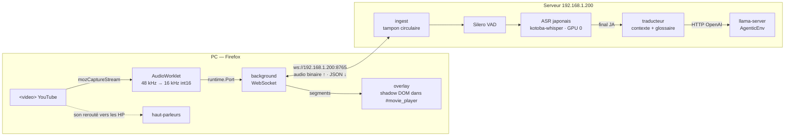
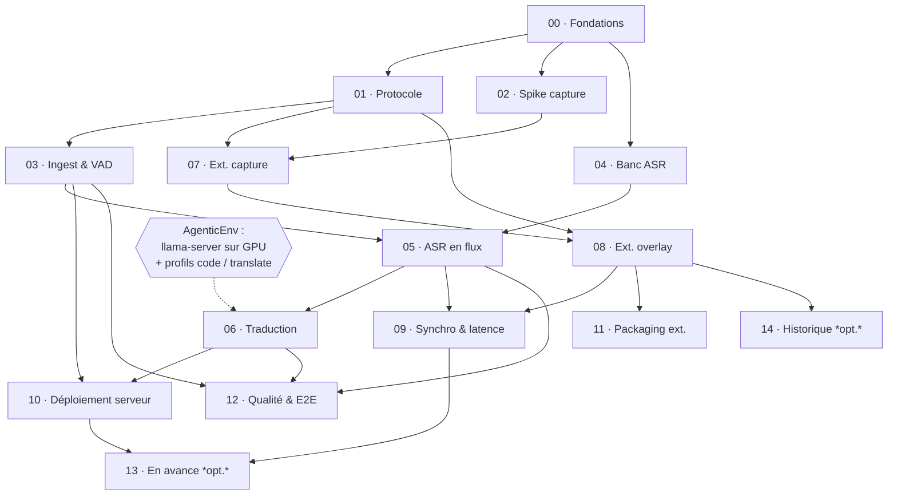

# Blueprint — sous-titres JA + EN en direct pour YouTube

Spécification du projet. Un fichier par **lot de travail** (WP) dans
[`wp/`](wp/), le graphe de dépendances ci-dessous, la matrice détaillée dans
[`dependencies.md`](dependencies.md), et les arbitrages techniques avec leurs
alternatives écartées dans [`decisions.md`](decisions.md).

---

## 1. Le besoin

Regarder dans Firefox, sur le PC du salon, un stream YouTube en japonais, et lire
**en quasi-direct** deux lignes de sous-titres : le japonais transcrit et sa
traduction anglaise. Les modèles tournent sur le serveur `192.168.1.200` (2×
V100 16 Go, 56 cœurs, 47 Go de RAM), qui est sur le même switch que le PC.

Trois qualités, dans cet ordre :

1. **Justesse du japonais.** Une traduction ne rattrape jamais une transcription
   fausse. C'est pour ça qu'on prend un modèle spécialisé japonais et qu'on le
   choisit sur un banc d'essai ([lot 04](wp/04-asr-benchmark.md)), pas sur sa
   réputation.
2. **Latence bornée et affichée.** Le sous-titre arrive forcément après la
   parole. L'objectif est de rester lisible : le japonais en ≤ 1,5 s (p50) après
   la fin de la phrase, l'anglais en ≤ 2,5 s (p50). La latence réelle est
   mesurée en permanence et visible dans le popup.
3. **Zéro friction.** On ouvre le stream, les sous-titres apparaissent. Pas de
   terminal, pas de lien à coller ailleurs, pas de service cloud.

## 2. Ce qui existe déjà sur le serveur

| Constat | Où | Conséquence |
|---|---|---|
| `llama-server` (llama.cpp) sert `Qwen3-Coder-30B-A3B-Instruct` en Q4_K_M, ctx 65 536, réparti sur les deux V100 (`split_mode: layer`), API OpenAI-compatible sur `127.0.0.1:8000` | `~/AgenticEnv/configs/models.yaml`, `llama-server.service` | La traduction réutilise cette infra : AgenticEnv bascule entre un profil `code` et un profil `translate` (le meilleur traducteur, choisi au lot 06), un seul modèle chargé à la fois ([ADR-003](decisions.md#adr-003--traduction-par-le-llama-server-dagenticenv-avec-des-profils-de-modèle)) |
| Socket `llama-bridge` sur `172.17.0.1:8001` pour joindre llama-server depuis un conteneur | `~/AgenticEnv/configs/llama-bridge.socket.j2` | Le serveur live-subs peut tourner en Docker ; quant-modeling fait déjà pareil |
| ⚠️ **Au 30/09/2026, `llama-server` tourne sur CPU** : 32,7 Go de RAM, aucune VRAM prise sur les deux V100 alors que `n_gpu_layers: all` | `systemctl status llama-server`, `nvidia-smi` | **Bloquant pour la latence de traduction.** À corriger côté AgenticEnv (issue à ouvrir), voir [lot 06](wp/06-translation.md) |
| Runtime Docker `nvidia` installé, driver 550, CUDA 12.4 disponible | `docker info` | Image serveur GPU sans bricolage |
| `uv`, `just`, Node 20, `gh` authentifié | — | Même outillage que les autres dépôts |

## 3. Architecture

**Le déroulé d'une phrase** : l'audio arrive par trames de 100 ms. Le VAD
ouvre un segment. Tant qu'il est ouvert, l'ASR re-décode la fenêtre en cours
environ toutes les secondes et renvoie un `partial` (gris, provisoire). À la fin
de la parole (≥ 400 ms de silence, ou 12 s de parole continue), il décode une
dernière fois et renvoie un `final`. Le `final` part à la traduction, dont les
jetons reviennent en flux (`translation_delta`, puis `translation`). Chaque
message porte les bornes du segment **en temps de l'audio capturé**, que
l'extension rapporte au temps de la vidéo.

## 4. Budget de latence (cible, à mesurer au lot 09)

| Étape | Budget p50 | Commentaire |
|---|---|---|
| Capture + trame | 100 ms | Taille de trame envoyée |
| Réseau LAN aller | < 5 ms | 32 ko/s de PCM int16 16 kHz |
| Détection de fin de parole | 400 ms | Silence minimal du VAD, réglable |
| ASR final (segment de 5 s) | 300 ms | kotoba-whisper sur V100 fp16, **à confirmer au lot 04** |
| **→ Japonais affiché** | **≈ 0,8–1,5 s** | après la fin de la phrase |
| Traduction (≈ 40 jetons, en flux) | 0,5–1 s | **si** llama-server est sur GPU ; sur CPU, plusieurs secondes |
| **→ Anglais affiché** | **≈ 1,5–2,5 s** | après la fin de la phrase |

Les `partial` réduisent le retard *perçu* : on voit le japonais se former
pendant que la personne parle.

## 5. Les lots de travail

| WP | Titre | Résumé |
|---|---|---|
| [00](wp/00-foundations.md) | Fondations & outillage | Arborescence, `uv` + ruff + mypy strict, TS + esbuild + web-ext, `justfile`, CI |
| [01](wp/01-protocol.md) | Protocole du fil | Messages, trames audio binaires, versionnage, miroir TS et test de dérive |
| [02](wp/02-capture-spike.md) | Spike capture Firefox | **Levée de risque, à faire tôt** : `mozCaptureStream` sur un live, son conservé, AudioWorklet sous la CSP de YouTube, WebSocket depuis le background, pubs |
| [03](wp/03-ingest-vad.md) | Ingestion & VAD | Serveur WebSocket, tampon par session, Silero VAD, découpage en segments |
| [04](wp/04-asr-benchmark.md) | Banc d'essai ASR japonais | CER et latence de kotoba-whisper, large-v3, large-v3-turbo, ReazonSpeech, anime-whisper sur des extraits de vrais streams → choix du modèle |
| [05](wp/05-streaming-asr.md) | Transcription en flux | `partial` / `final`, accord local entre décodages, filtre d'hallucinations, ponctuation |
| [06](wp/06-translation.md) | Traduction | Client llama-server, contexte glissant, glossaire par chaîne, flux de jetons, banc de traduction |
| [07](wp/07-extension-capture.md) | Extension : capture & transport | Détection du lecteur, navigation SPA, pubs, AudioWorklet, port vers le background, reconnexion |
| [08](wp/08-extension-overlay.md) | Extension : overlay & réglages | Sous-titres deux lignes, provisoire vs définitif, plein écran, popup, page d'options, raccourcis |
| [09](wp/09-sync-latency.md) | Synchronisation & latence | Horloge audio ↔ `currentTime`, mesure bout en bout, HUD de latence, métriques serveur |
| [10](wp/10-server-deploy.md) | Déploiement serveur | Image Docker GPU, compose, écoute LAN, `llama-bridge`, santé, démarrage au boot |
| [11](wp/11-extension-packaging.md) | Packaging de l'extension | Build, signature AMO « non listée », installation permanente, mises à jour |
| [12](wp/12-quality-e2e.md) | Qualité & bout en bout | Fixtures libres, `just replay`, tests dorés, faux ASR / LLM, checklist manuelle |
| [13](wp/13-ahead-of-live.md) | *(optionnel)* Mode « en avance » | Le serveur tire lui-même le flux (yt-dlp) au bord du direct, la vidéo est regardée quelques secondes en retard : sous-titres synchrones |
| [14](wp/14-history-export.md) | *(optionnel)* Historique & export | Panneau de transcript défilant, recherche, export SRT / VTT |

## 6. Graphe de dépendances

**Chemin critique** : `00 → 01 → 03 → 05 → 06 → 10`, avec `04` (banc ASR) en
parallèle de `03` et le spike `02` en parallèle de `01`. Le premier jalon
utilisable, « je vois du japonais sur mon stream », c'est `00 · 01 · 02 · 03 ·
05 (avec le modèle par défaut) · 07 · 08`. La traduction vient ensuite.

## 7. Jalons

| Jalon | Lots | Ce qu'on voit |
|---|---|---|
| **M0 — risque levé** | 00, 02 | Un WAV 16 kHz propre, enregistré depuis un live YouTube par l'extension de spike, et le son resté audible |
| **M1 — japonais en direct** | 01, 03, 05, 07, 08 | Sous-titres japonais sur le stream, `partial` puis `final` |
| **M2 — anglais en direct** | 04, 06, 09 | Deux lignes, latences mesurées dans le popup, modèle ASR choisi sur données |
| **M3 — installé pour de bon** | 10, 11, 12 | Serveur au boot, extension signée, tests dorés en CI |
| M4 — confort | 13, 14 | Optionnel |
